<!-- ═══════════════════════ HERO ═══════════════════════ -->
<div align="center">


<a href="https://git.io/typing-svg">
  
</a>

<br/>


</div>

---

## 🛡️ About Me

```bash
jp@codesmith:~$ whoami
JP CodeSmith — software engineer moving from "it works" to "it's secure, observable and shippable"

jp@codesmith:~$ cat mission.txt
Build real-world products. Understand the whole system underneath them.
Bake security into every stage of the pipeline, not bolt it on at the end.

jp@codesmith:~$ cat philosophy.txt
Don't just make it work. Understand why it works. Then make it safe.
```

I build across the stack: interfaces, mobile apps, APIs, databases, infrastructure and AI-powered tools. My direction is **DevSecOps**: automating delivery while treating security, reliability and visibility as first-class features.

---

## 🔄 My DevSecOps Pipeline

```mermaid
flowchart LR
    A[💡 Plan<br/>Threat Modeling] --> B[⌨️ Code<br/>Pre-commit Hooks]
    B --> C[🔍 Build<br/>SAST • Secrets Scan]
    C --> D[🧪 Test<br/>DAST • Dependency Audit]
    D --> E[📦 Package<br/>Image Scan • SBOM • Sign]
    E --> F[🚀 Deploy<br/>IaC Scan • Policy Gates]
    F --> G[📡 Operate<br/>Monitor • Alert]
    G --> H[🔁 Feedback<br/>Improve]
    H --> A

    style A fill:#0d1117,stroke:#00e5ff,color:#fff
    style B fill:#0d1117,stroke:#00e5ff,color:#fff
    style C fill:#0d1117,stroke:#00c2a8,color:#fff
    style D fill:#0d1117,stroke:#00c2a8,color:#fff
    style E fill:#0d1117,stroke:#00e5ff,color:#fff
    style F fill:#0d1117,stroke:#00e5ff,color:#fff
    style G fill:#0d1117,stroke:#00c2a8,color:#fff
    style H fill:#0d1117,stroke:#00c2a8,color:#fff
```



| Stage | What I care about | Tools I'm working with / toward |
|:--|:--|:--|
| 🧭 **Plan** | Threat modeling, least privilege, secure-by-design | STRIDE, OWASP Top 10 |
| ⌨️ **Code** | Catch mistakes before they leave my machine | pre-commit, Gitleaks |
| 🔍 **Build** | Static analysis, secret detection, dependency checks | Semgrep, Trivy, npm/pip audit |
| 🧪 **Test** | Automated tests and dynamic scanning | Vitest/Jest, pytest, OWASP ZAP |
| 📦 **Package** | Minimal images, SBOMs, signed artifacts | Docker, Syft, Cosign |
| 🚀 **Deploy** | Reproducible infra, policy as code | Terraform, Checkov, Kubernetes, GitHub Actions |
| 📡 **Operate** | Metrics, logs, alerts, incident readiness | Prometheus, Grafana |

---

## 🧰 Tech Arsenal

### 🔐 DevSecOps · Infrastructure · Systems
<p>
  
</p>

### ⚙️ Backend · Data
<p>
  
</p>

### 🌐 Frontend · 📱 Mobile
<p>
  
</p>

---

## 📊 GitHub Analytics

<div align="center">

### 🔥 Daily Push Streak


<br/><br/>


### 🧬 Language Breakdown (compact)


### 📈 Contribution Graph


### 🏆 Trophies


</div>

---

## 🐍 Contribution Snake

<div align="center">
  <picture>
    <source media="(prefers-color-scheme: dark)" srcset="https://raw.githubusercontent.com/JP-CODESMITH/JP-CODESMITH/output/github-snake-dark.svg" />
    <source media="(prefers-color-scheme: light)" srcset="https://raw.githubusercontent.com/JP-CODESMITH/JP-CODESMITH/output/github-snake.svg" />
    
  </picture>
</div>

---

## 🚀 Featured Projects

<table>
<tr>
<td width="50%" valign="top">

### ⚒️ CodeSmith Agent
**AI developer command center, terminal-first**

Helps developers understand, explore and work with projects while staying in control: persistent sessions, project-aware context, tool execution, **permission and approval workflows**, agent observability, and token/context visibility.


</td>
<td width="50%" valign="top">

### 🤖 VisionForge
**AI-powered API testing and validation platform**

AI-assisted test generation, API validation, regression detection, monitoring and structured reporting. This is security-minded quality engineering in practice.


🔗 [Live Demo](#) · [GitHub](#)

</td>
</tr>
<tr>
<td width="50%" valign="top">

### 🌱 FarmRoute
**Digital agricultural marketplace and ecosystem**

Connects farmers, buyers and logistics providers: marketplace, fisheries, interstate logistics, secure payment workflows, ratings, farm records and AI-assisted farming.


</td>
<td width="50%" valign="top">

### 🍽️ DeDiaspora
**Digital restaurant platform**

Menus, reservations, booking zones, recipes, gallery, blog, admin analytics, international phone and currency handling, plus dietary and allergy information.


</td>
</tr>
<tr>
<td colspan="2" valign="top">

### 🛍️ LigowinShopper
**Deployed e-commerce platform**: product discovery, detail experiences, responsive shopping UI and media management.   

</td>
</tr>
</table>

---

## 🎯 Currently Levelling Up

```yaml
building:    CodeSmith Agent
learning:
  - Secure CI/CD pipelines (GitHub Actions)
  - Container and image hardening (Docker, Trivy)
  - Infrastructure as Code and policy as code (Terraform, Checkov)
  - Kubernetes fundamentals and workload security
  - Observability (Prometheus, Grafana)
exploring:   AI engineering, agentic workflows, secure AI tooling
improving:   Software architecture and threat modeling
shipping:    Real-world products
```

### 🗺️ Roadmap

```text
Software Development ─► Backend Engineering ─► Linux & Systems
        │                                            │
        ▼                                            ▼
   DevOps & CI/CD  ─►  Cloud Infrastructure  ─►  DevSecOps
                                                     │
                                                     ▼
                                     Production & Security Engineering
```

---

## 🤝 Let's Build

Open to collaborating on **open-source**, **DevSecOps tooling**, **full-stack and mobile products**, **backend systems**, **AI-powered developer tools** and real-world technology solutions.

<div align="center">

[](https://github.com/JP-CODESMITH)
[](#)
[](mailto:your@email.com)

<br/>

```text
   PLAN → CODE → BUILD → TEST → SECURE → DEPLOY → MONITOR → REPEAT
```

**Keep Building. Keep Securing. Keep Shipping.** 🛡️


</div>
